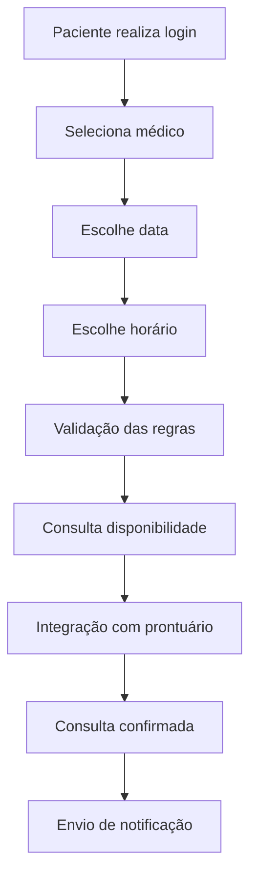

# Fluxo de Agendamento

```mermaid
flowchart TD

A[Paciente realiza login]

A --> B[Seleciona médico]

B --> C[Escolhe data]

C --> D[Escolhe horário]

D --> E[Validação das regras]

E --> F[Consulta disponibilidade]

F --> G[Integração com prontuário]

G --> H[Consulta confirmada]

H --> I[Envio de notificação]
```