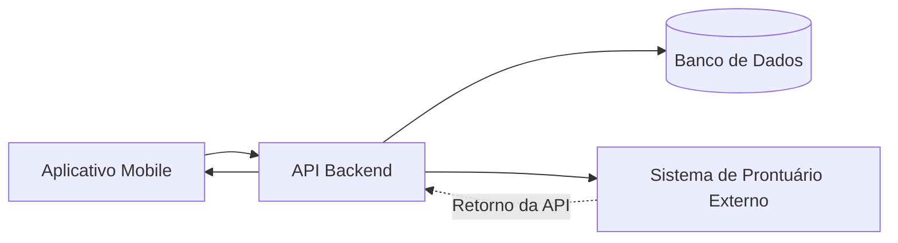

# Arquitetura do Sistema

## Visão Geral

O aplicativo é composto por um cliente móvel, uma API de backend, um banco de dados e uma integração com um sistema externo de prontuário eletrônico.

A integração com o sistema externo é considerada crítica para a entrega do projeto, pois é responsável por registrar e consultar informações clínicas.

## Diagrama da Arquitetura

## Componentes

### Aplicativo Mobile

Responsável pela interação com pacientes e médicos.

### API Backend

Centraliza as regras de negócio, autenticação, agendamento e comunicação com os demais componentes.

### Banco de Dados

Armazena informações de usuários, médicos, agendas e consultas.

### Sistema Externo de Prontuário

Sistema de terceiros utilizado para registrar e consultar dados clínicos. Como sua documentação é limitada e houve mudanças recentes, representa um dos principais riscos técnicos do projeto.